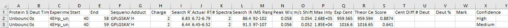
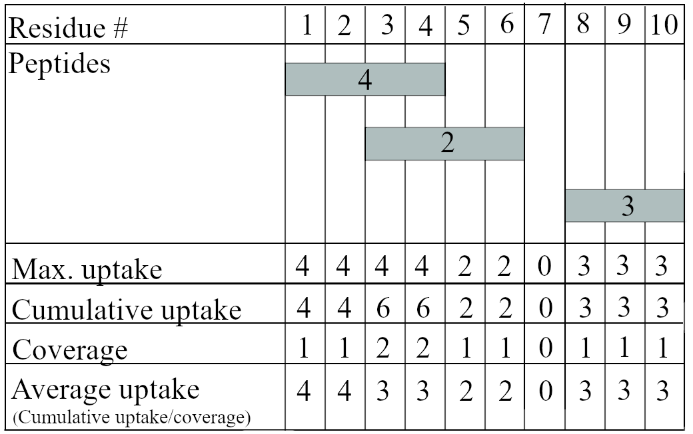

```{r, include = FALSE}
knitr::opts_chunk$set(
  collapse = TRUE,
  comment = "#>",
  fig.align="center"
)
```

HDX-MS is a high-information-content method.
It is both a curse and a blessing.
A lot can be learned, but data analysis is tedious, as each experiment in HDX-MS provides information on hundreds of peptides.
Each experiment should be done at least in triplicate.
Very often, multiple time points for each protein state are performed.
Finally, multiple protein states are compared, as the goal of performing HDX-MS is often to compare how ligand binding or mutation affects the wild-type apo protein state.
This can easily lead to a dataset with multiple thousand peptides that need to be matched between the sets compared and deemed statistically relevant or not.
HDXBoxeR provides a statistical framework to identify peptides that are significantly different between given protein states.
HDXBoxeR automatically matches and compares sets with each other.
It calculates if one protein state is different from another using Welch's T-test and the Critical Interval statistical framework (Hageman and Weis; Anal. Chem. 2019, 91, 13, 8008–8016).
It allows for fast data export and generates scripts for Pymol.
Finally, it returns all the calculations required for publication, as recommended by Masson et al. in Nature Methods volume 16, pages 595–602 (2019).

HDXBoxeR facilitates multiple aspects of HDX data analysis:

1.  Reprocesses data to the format required for data publication.
2.  Calculates parameters for a general HDX summary table, such as backexchange, peptide lengths, and statistical information required for data publication.
3.  Converts the output from HDXExaminer (Sierra Analytics, now Trajan Scientific) to a format that is easier to handle and analyze.
4.  Using Welch T-tests, it identifies peptides that are significantly different between the sets.
5.  Generates scripts for Pymol.
6.  Facilitates easy plot generation, including heat maps, robot plot (modified butterfly plot), significant peptides, volcano plots, and average deuteration.
7.  Generates inputs for ExtReme. The package allows for comparison between different protein states and facilitates the discrimination of peptides that are significantly different between the sets.

# How to use this vignette?

The vignette is divided into several sections that introduce different aspects of analysis:

1.  Input Preparation: Learn how to prepare inputs for HDXBoxeR in HDXExaminer.
2.  Installation: Get started and set up the necessary components.
3.  Inputs Reprocessing: Understand how to prepare inputs to be usable in R.
4.  Statistical Analysis: Explore which peptides are significant.
5.  Plots Generation: Visualize the peptides deemed significant.
6.  Pymol Scripts Generation: Create scripts listing significant peptides and residues.
7.  Data Summary: Obtain general information about the dataset.
8.  Save Data: Save data in the reprocessed format.
9.  ExtReme Outputs Generation: Automatically prepare input for bimodal analysis.
10. Proposed Workflow: A section for those in a hurry. These changes aim to enhance consistency in language and formatting across the different sections.

## 1. Input preparation

The HDXBoxeR requires data!
The package can be tested using the data included as a reference and example with the package, so don’t worry.
However, to be able to perform your analysis, you need to import your data into R.
Input for the HDXBoxeR should be generated using HDXExaminer from Sierra Scientifics.

### Input preparation

Input preparation: 1.
Open your HDexaminer file.
2.
Under the Peptides tab \> Pool \> right-click peptide: delete peptides with no usable data.
3.
Tools \> Options \> Display \> Deuteration Table: Display all columns (we did not select show low-confidence results).
4.
Tools \> Export \> All results table.

HDXBoxeR significantly facilitates the comparison of multiple Protein States in the time series and the number of replicates.
We recommend using at least 3 replicates for a robust statistical analysis.
All the Protein States imported are required to have the same number of replicates.
Another recommendation is to use only peptides the user is confident in.
There is no point in analyzing bad data.

The example looks as follows:



The input file should have the following columns: Protein State, Deut Time, Experiment, Start, End, Sequence, Charge, Search RT, \# Deut, Deut %.
If any of these columns is missing data will not be loaded.
Another thing to make sure of is that the columns are properly aligned, meaning there is the name number of headers and columns, as sometimes the Confidence column gets shifted in the AllResultsTable.csv file.
We keep typically just peptides with high and medium confidence.
Example data compares two Protein States: Unbound and Bound.
Each of the sets has three replicates.
Data also should have one replicate of undeuterated and fully deuterated sets labeled as 0s and FD respectively for allowing full analysis.

## 2. Installation & Loading

First, ensure that you have R and RStudio installed on your computer.
Then you can proceed with the installation of the HDXBoxeR package.
There are two methods to install the HDXBoxeR package:

1.  CRAN

To install, use the following command:

```{r eval=FALSE}
####installation using CRAN
install.packages("HDXBoxeR") #execute only once

```

2.  GitHub

The HDXBoxeR package is available on GitHub and can be installed using the devtools package.
This method of installation is an alternative to the CRAN method.

```{r eval=FALSE}
####installation using Github. 
#run only if devtools package is not installed on your machine
install.packages("devtools") 

library(devtools) #run next two commends only once
devtools::install_github("mkajano/HDXBoxeR")

#Once installed, you can load the HDXBoxeR package using the following command:
library(HDXBoxeR)

```

## 3. How to load data into R

To load data into R, you will need input as described in section 1.
Example input is provided as a reference, and to start the fun.
Data, when loaded, will be reprocessed into different formats depending on the type of analysis to be performed.
There are several options in which input can be processed, as listed below.
Function names reflect the chosen option.

Input can be formatted to:

-   Analyze time points *or* time courses analysis (`output_tp` vs `output_tc` functions).
-   Analyze Deuterons Uptake *or* Percent Deuteration (flag `percent=F/T`).
-   Use all protein states/deuteration times *or* use selected (options: `states` and `times`, respectively).
-   Use a maximum common number of replicates used *or* specify how many replicates should be used (`replicates` option in the function).
-   Match Peptide sequence between protein states *or* not. Default is set to match peptide sequences to prevent mismatches; use functions with flag `match_seq`.

Examples:

```{r}
# Path to example input
library(HDXBoxeR)
file_nm<-system.file("extdata", "All_results_table.csv", package = "HDXBoxeR") 
### Later change the path to the path you your data!!!

##########Deuteration uptake vs percent deuteration file preparation
#### Input for uptake deuteration. Default will use all common states, all common Deuteration Times, max. common number of replicates, no csv will be written, and peptide sequences will be matched. 
input_uptake_timepoint<-output_tp(filepath = file_nm) 
# input for percent deuteration
input_deut_timepoint<-output_tp(filepath = file_nm, percent=T) 

#################
####Time courses 
#Deuteration uptake
input_uptake_timecourse<-output_tc(file_nm) 
# Time courses comparisons
input_deut_timecourse<-output_tc(file_nm, percent=T)

#################
####Analyze selected protein.states, deuteration times, replicates. 
names_states<- nm_states(file_nm) ## returns names of the states in file.
input_two_states_two_timepoints<-output_tp(filepath=file_nm, replicates=3, states=names_states[c(1,2)], times=c("3.00s", "72000.00s"),  percent=FALSE)
###add option to match sequence and to save as csv (here not used)
input_subset_states<-output_tp(filepath=file_nm, replicates=3, states=names_states[2], times=c("3.00s", "72000.00s"), percent=FALSE, seq_match=FALSE, csv="NA")

```

**Now that the data is loaded let’s start the fun!**

## 4. Statistical Analysis

Great!
Now that the hardest part is done, let’s delve into the actual analysis.

**HDXBoxeR provides a statistical framework to identify peptides that are significantly different between given protein states.** To conduct statistics, we recommend providing at least 3 replicates for each protein state (duplicate data also work).
**The number of replicates and Deut Time will be trimmed to be the same for all Protein States in the analysis.**

### Some theoretical details about statistical analysis

HDXBoxeR employs a hybrid statistical approach using the Welch T-test and Critical interval statistical framework proposed by Hageman and Weis (Hageman and Weis; Anal. Chem. 2019, 91, 13, 8008–8016).
To be deemed significantly different, peptides must meet significance criteria on both the individual peptide level (Welch T-test) and surpass the global critical interval for all peptides in the set.

For detailed information, please refer to the cited paper (Hageman and Weis; Anal. Chem. 2019, 91, 13, 8008–8016).
In short, the Welch T-test determines if the Null hypothesis can be rejected (Null hypothesis: the average of two means for individual peptides are equal).
If the individual critical interval was below the p-value, the null hypothesis was rejected – peptides were deemed significant from an individual peptide standpoint.
For the global significance threshold, the propagated standard error of the pooled standard deviation of means for all peptides in two sets was calculated and scaled to the Student distribution.
This involves calculating the pooled standard deviation for two sets separately, propagating the error overall standard deviation of these two sets, and finally, scaling it by T-distribution to determine the global critical interval that is the global threshold.
If the peptides passed both criteria for the whole set and individual peptides, they were deemed significant.

### Practical Tips for Statistical Analysis in HDXBoxeR

Most of the statistical analysis is already implemented in plot and other functions, but it is good to have a way to do it yourself if needed.
HDXBoxeR allows for the facile calculation of averages and the standard deviation for each set.
Additionally, it allows for the calculation of global and individual critical intervals.

**Individual p-values for each peptide are calculated against the first protein state based on the location from the input file. If the user desires calculation against different protein states, it can be done by loading HDXExaminer, taking advantage of the `states` parameter in `output_tp()` or `output_tc()` functions.**

```{r}
library(HDXBoxeR)
file_nm<-system.file("extdata", "All_results_table.csv", package = "HDXBoxeR") 
input_uptake_timepoint<-output_tp(filepath = file_nm) 


###average calculation for all peptides
av1<-ave_timepoint(input_uptake_timepoint)
head(av1)
###average differences (against first Protein State in the file)
da1<-dif_ave(av1)

###standard deviation calculation for all peptides
sd1<-sd_timepoint(input_uptake_timepoint)
head(sd1)

### Global critical interval for 1 protein sets
CI_single(s1 =sd1[,7], replicates = 3 )
##Global critical interval for 2 protein sets
CI_2pts(s1 = sd1[,7], s2=sd1[,8], replicates = 3)

##individual peptide p-value calculation against first set in the input file
pv1<-pv_timepoint(input_uptake_timepoint)
head(pv1)


####Analyze selected protein.states, deuteration times, replicates. 
names_states<- nm_states(file_nm) ## returns names of the states in file.
### choosing different state as a control for analysis
input_states_reversed<-output_tp(file_nm, states=names_states[c(2,1)] )
pv2<-pv_timepoint(input_states_reversed)
head(pv2)
```

### States, Replicates, Timepoints, etc.

There are a few variables that are going to be useful while analyzing the data.
It might be a good idea to have them saved in the memory.
One can call them as follows:

```{r}
###load data

states<-arguments_call1(filepath=file_nm)
times<-arguments_call2(filepath=file_nm, states=states)
replicates<-arguments_call3(filepath=file_nm, states=states, times=times)

```

### Sub-setting of the Input Table

Sometimes, we do not want to work on or plot the whole imported dataset.
One can either load a smaller subset or choose a part of the subset from the loaded dataset to work on.
The already loaded data can be subsetted using the `select_indices` function or by choosing desired columns from the loaded data.
In the loaded data, the first 6 columns always describe peptides, and the rest of the columns contain data.

```{r}


#################
####Time courses 
#Deuteration uptake
input_uptake_timecourse<-output_tc(file_nm) 
# Time courses comparisons

small_df1<-input_uptake_timepoint[,c(1:6, 10:12)]

#if one wants to focus just on the few first peptides in the data it is possible to select a few rows from the input data. 
small_df2<-input_uptake_timepoint[1:3,]

#To have more control of the selecting one can also use the select_indices functions as follows:
##for output_tp function variables that can be used are:
#below one time of 60s was used for peptides that started at residue 50, ended at residue 100 and  at the max 12 residues long. 
#not all parameters need to be used.
inda<-select_indices(input_uptake_timepoint,  times = c("60.00s"),start = 50, end=100, length=12)

#after the indices are selected the input can be subsetted as normal

small_df3<-input_uptake_timepoint[inda,]

##for the output_tc function allowed are the following parameters
timecourse_output<-output_tc(file_nm) 
indb<-select_indices(timecourse_output,  states = "bound",start = 50, end=100, length=12)

head(timecourse_output[indb,1:6])

```

## 5. Plots

HDXBoxeR features functionality to create various types of plots, including volcano plots, heat maps, and robot plots (modified butterfly plots).

**Information on how to load input into HDXBoxeR can be found in section 3.** If the returned plots have truncated labels, adjust the figure sizes.

### Uptake Plots

Sometimes, it is just useful to look at raw-ish data.
Uptake plots are the answer here.

```{r figuptake, fig.height = 3.5, fig.width = 5}
###load data
library(HDXBoxeR)
file_nm<-system.file("extdata", "All_results_table.csv", package = "HDXBoxeR") 
input_deut_timepoint<-output_tc(file_nm, percent=TRUE) 

# define the timepoint using in the experiment. Here the times in seconds
x<-c(3, 60,1800, 72000)
uptake_plots(input_deut_timepoint[1:2,],x)

```

### Boxplots

Boxplots enable quick comparisons of average uptake or percent deuteration for all protein states.

```{r fig1, fig.height = 5, fig.width = 3.5}
###load data
# library(HDXBoxeR)
# file_nm<-system.file("extdata", "All_results_table.csv", package = "HDXBoxeR") 
# input_uptake_timepoint<-output_tp(file_nm) 


### Returns boxplots for all the time points and all protein states. 
boxplot_tp(input_uptake_timepoint, col= c("gold2", "dodgerblue"))
```

### Average uptake and procent deuteration plots per time-point

```{r fig2, fig.height = 5, fig.width = 4}
###load data
library(HDXBoxeR)
file_nm<-system.file("extdata", "All_results_table.csv", package = "HDXBoxeR") 
# ## input for deuteration uptakeinput_uptake_timepoint<-output_tp(file_nm) 
# # input for procent deuteration
input_deut_timepoint<-output_tp(file_nm, percent=T) 

## deuteration uptake for time points
plots_av_tp(input_uptake_timepoint)
### average plots with colors chosen by user. 
plots_av_tp(input_uptake_timepoint,replicates=3, cola=c(1:10))
### average percent deuteration
plots_av_tp_proc(input_deut_timepoint)

```

### Difference Uptake or Percent Deuteration Plots per Time-point

The average difference plots depict deuteration uptake (or percent deuteration) between different Protein states.
By default, the first Protein State from the input file is chosen as a state from which other values are subtracted.
For example, if the input file has three Protein States: State1, State2, State2, average difference plots will show two curves for the difference in deuteration uptake: (1) State1-State2, (2) State1-State3.
If other permutations are desired, use the `states` parameter in `output_tp` or `output_tc` functions.
All time-points are drawn on separate plots.
The function is useful when comparing multiple Protein States.

```{r fig4, fig.height = 5, fig.width = 4}
# ###load data
# file_nm<-system.file("extdata", "All_results_table.csv", package = "HDXBoxeR") 
# ## input for deuteration uptake
# input_uptake_timepoint<-output_tp(file_nm) 


## difference in uptake deuterations between two sets
plots_diff_tp(input_uptake_timepoint)

#Load deut data
# input for procent deuteration
# input_deut_timepoint<-output_tp(file_nm, percent=T) 

### difference in procent deuteration
plots_diff_tp_proc(input_deut_timepoint,replicates=3, cola=4)

#input with different order states
names_states<- nm_states(file_nm)
input_reversed_states<-output_tp(file_nm, states = rev(names_states))
### average plots for deuteration uptake where control state was chosen differently
plots_diff_tp(input_reversed_states, col="darkgreen")

```

### Volcano Plots

Volcano plots were introduced by the Weis laboratory (Analytical Chemistry 2019, 91 (13), 8008-8016 DOI: 10.1021/acs.analchem.9b01325).
The strength of the volcano plots is that they allow for a quick view to see how many peptides are between the sets and provide statistics for the differences.
The Volcano plots take advantage of the p-value and critical interval calculation.
The p-value is calculated per each peptide using the Welch t-test for the desired number of replicates.
The global critical interval is calculated as described in Hageman and Weis (Analytical Chemistry 2019, 91 (13), 8008-8016 DOI: 10.1021/acs.analchem.9b01325).
As the default alpha is set to 0.99, the p-value cut off is marked by horizontal lines, and the global critical interval by vertical lines.
Significantly different peptides between the sets are located in the shaded area.
The volcano plots are only prepared for differences in deuterons uptake.
The critical intervals for all time-points are returned in the terminal.

```{r fig5, fig.height = 5, fig.width = 4}
###load data
file_nm<-system.file("extdata", "All_results_table.csv", package = "HDXBoxeR") 
## input for deuteration uptake
a<-output_tp(file_nm) 

### basic volcano plot
plots_vol_tp(a)
# change colors for significant peptides in volcano plots
plots_vol_tp(a, cola=c(2,3), replicates=3)
#change pv_cutoff from 0.01 to 0.1
plots_vol_tp(a, pv_cutoff = 0.1)

```

### Significant Peptides Mapped Along Residue Sequence

The significant peptides plots draw peptides along the covered sequence of the protein.
Peptides deemed significantly different using the Welch test and the global critical interval criterion are colored in a red-blue scheme.
Red-colored peptides are more exposed compared to the control set, while blue colors correspond to increased protection compared to the control set.
Non-significant peptides are colored black.

The plots can be drawn using either percent deuteration or deuteration uptake input sets.
If the percent deuteration input is used, the difference between the two sets is colored according to the chosen scheme (function `plot_peptide_sig_tp_proc`).
If using deuteration uptake input, data is converted to percents using the equation: `(Uptake(state1) - Uptake(state2)) / Uptake(state1) * 100%` (function: `plot_peptide_sig_tp`).

Percent differences are divided into ranges, each corresponding to a specific color in the red-blue color scheme.
Range values can be changed as desired within the red-blue color scheme.
In the terminal, ranges for each set are returned to help choose ranges of the color scheme.

Plots are generated separately for each time-point and each pair of the difference values (State1-State2, State1-State3…).
The `plot_peptide_sig_tp` generates multiple plots, which usually calls for using the plotting parameter `mfrow`.

```{r fig6, fig.height = 5, fig.width = 4}
###load data
file_nm<-system.file("extdata", "All_results_table.csv", package = "HDXBoxeR") 
## input for deuteration uptake
a<-output_tp(file_nm) 

### significantly different peptides are colored in red-blue scheme. 

#par(mfrow=c(4,1))  # uncomment if desired
plot_peptide_sig_tp(a,replicates = 3) 

### Plot where 18 peptides per row are drawn (nb_pep_row=18, default=50), 
#p-value&critial interval was made more stingent (0.001)
# % ranges are colored were changed. 
#par(mfrow=c(4,1)) #uncomment if desired
plot_peptide_sig_tp(a,nb_pep_row = 18, ranges = c(-Inf, -10, -2.5,0,2.5, 10, Inf), pv_cutoff = 0.001) 

```

```{r leg1, fig.height = 3, fig.width = 2.5}
## Legend for significant peptides plot
#default ranges for figures does not require argument
legend_sig_peptides()
### Using different range scheme
legend_sig_peptides(ranges = c(-Inf, -10, -2.5,0,2.5, 10, Inf))

```

### Differential heat maps

Differential Heat Maps are plots where peptides significantly different between the sets are translated into residue-specific information.
Heat maps are a fast, highly informative, and elegant way to see which regions are perturbed in the sets.
However, it means that some information is lost (coverage).
There are two options on how these calculations are performed:

1.  Average uptake of all significant peptides containing that residue is calculated.
2.  Maximum uptake value from all peptides classified as significant with that residue in its sequence.

Differential heat maps can be calculated using the difference in percent deuteration between two sets or uptake of (control - other sets) / (uptake of control) \* 100.

The example scheme for how average uptake and maximum uptake per residue are generated is shown below.

{width="50%"}

```{r fig7, fig.height = 3, fig.width = 5}
###load data
library(HDXBoxeR)
file_nm<-system.file("extdata", "All_results_table.csv", package = "HDXBoxeR") 
## input for deuteration uptake
a<-output_tp(file_nm) 
# input for procent deuteration
b<-output_tp(file_nm, percent=T) 

##Average uptake heat maps
### heat maps 
plot_heat_map_tp(a, replicates=3, mar_x=3)
##change some parameters
plot_heat_map_tp(a, mar_x=1, 
                 ranges = c(-Inf, -10, -2.5,0,2.5, 10, Inf), pv_cutoff=0.01)

### heat map for percent deuteration, require both uptake and percent deuteration data frame as input
plot_heat_map_tp_proc(input_up = a, input_proc = b, replicates=3)

###Maximum uptake or percent deuteration per peptide
plot_heat_map_max_uptake_tp(a, replicates=3)
### #
plot_heat_map_max_uptake_tp_proc(input_up = a, input_proc = b, replicates=3, mar_x=1, ranges = c(-Inf, -10, -2.5,0,2.5, 10, Inf), pv_cutoff=0.01)
```

```{r leg2, fig.height = 3, fig.width = 2.5}
## Legend for the heatmaps.
#default ranges for figures does not require argument
legend_heat_map(ranges = c(-Inf, -10, -2.5,0,2.5, 10, Inf))

```

### Woods Plots

Woods plots come in two flavors: one that looks at the time course or timepoints.
Below are examples.
The usage of the `subset_indices` is highly recommended.

```{r fig_woods, fig.height = 5, fig.width = 5}
##
file_nm<-system.file("extdata", "All_results_table.csv", package = "HDXBoxeR") 


tp_aP<-output_tp(filepath = file_nm, percent=T) #timepoints
indp<-select_indices(tp_aP,  times = c("3.00s", "60.00s"))
deuteration_woods_timepoints(tp_aP[indp,], replicates = 3)

## input for timecourses 
tc_aP<-output_tc(filepath = file_nm, percent=T) #timecourse
deuteration_woods_timecourse(tc_aP, replicates=3)


```

### Timecourse Plots

Basic plots for the timecourse include average deuteration plots and the heatmap.
No significant peptide analysis was done in these plots.
For statistical analysis in timepoints, please use robot plots (see the next section).

```{r fig9, fig.height = 4, fig.width = 5}
##
file_nm<-system.file("extdata", "All_results_table.csv", package = "HDXBoxeR") 
## input for timecourses for procent deuteration and uptake
tc_aP<-output_tc(filepath = file_nm, percent=T)

## average procent deuteration in timecourse
plots_av_tcourse(tc_aP, replicates = 3)
###average heat map for timecourses
plot_heat_map_tc(tc_aP, replicates=3)
legend_heat_map_timecourse()


```

### Robot Plots

The robot plots are a modification of the butterfly plots.
The main difference is that while in the butterfly plots peptides were depicted as a single dot in the middle of the peptide, in robot plot peptides, the whole peptide length is drawn.
This replaces butterfly plots' nice curves with hard edges, which could not be called a delicate butterfly but rather the clinical look of a robotic machine.

The robot plots choose only significant peptides to be drawn.
If the peptide is significant in one timepoint, it will be drawn at all time-points, but only significantly different peptides will be colored.
The robot plots compare two different data sets: one is drawn above the x-axis, the other below the x-axis.

```{r fig8, fig.height = 5, fig.width = 5}
###load data
library(HDXBoxeR)
file_nm<-system.file("extdata", "All_results_table.csv", package = "HDXBoxeR") 
## input for timecourses for procent deuteration and uptake
tc_a<-output_tc(filepath = file_nm)
tc_aP<-output_tc(filepath = file_nm, percent=TRUE)

###All peptides drawn 
robot_plot_All(thP = tc_aP, th=tc_a)
###USe more stingent parameters to have less peptides drawn. CI_factor is a factor that modifies (multiplicate) Critial interval. 
robot_plot_All(thP = tc_aP, th=tc_a, pv_cutoff=0.005, replicates = 3)


```

If the robot plots are too crowded, we recommend removing peptides from the robot plot by making the p-value and critical interval more stringent.
However, even then, some areas of the plot are too crowded, so manual removal of peptides is necessary to prepare a final plot.
To determine which peptides should be removed (or kept), we recommend first looking at the plot and then running the `robot_indexes_df()` function, which returns all significant peptides in the set.
After that, one should choose indexes that the user wants to keep and run the `robot_2states_indexes()` function.
A note for all these functions: only two states of the proteins should be given, not the whole sets (parameter `states`).

```{r fig8a, fig.height = 4, fig.width = 5, echo=FALSE}
library(HDXBoxeR)
file_nm<-system.file("extdata", "All_results_table.csv", package = "HDXBoxeR") 
## input for timecourses for procent deuteration and uptake
tc_a<-output_tc(filepath = file_nm)
tc_aP<-output_tc(filepath = file_nm, percent=T)
names_states<- nm_states(file_nm) ## only two protein states should be used in functions below. 

## returns dataframe with all significant peptides with pvalue=0.01, CI_factor=2
robot_indexes_df(thP = tc_aP, th=tc_a, states=rev(names_states)[1:2], 
                    pvalue = 0.005, CI_factor=1.5)

#list of indexes 
inds<-robot_indexes(thP = tc_aP, th=tc_a, states=rev(names_states)[1:2], 
                    pvalue = 0.001, CI_factor=1) ###return indexes of peptide


# Make a final robot plot. Above the plot there is bar that showing lack of coverage in the sets (grey), no coverage on plot (blue), coverage on plot (orange). 
robot_2states_indexes(thP = tc_aP, th=tc_a, states=rev(names_states)[1:2],indexes = inds,  pvalue = 0.001, CI_factor=1,  ylim=c(-120, 120), xlim=c(50, 230))

```

### Woods_CI plots

Very similar to robot plots, but slightly different representation.

```{r fig_woods_CI, fig.height = 5, fig.width = 5}
###load data
library(HDXBoxeR)
file_nm<-system.file("extdata", "All_results_table.csv", package = "HDXBoxeR") 
## input for timecourses for procent deuteration and uptake
tc_a<-output_tc(filepath = file_nm)
tc_aP<-output_tc(filepath = file_nm, percent=TRUE)

###All peptides drawn 
woods_CI_plot(thP = tc_aP, th=tc_a)
###USe more stingent parameters to have less peptides drawn. CI_factor is a factor that modifies (multiplicate) Critial interval. 
woods_CI_plot(thP = tc_aP, th=tc_a, pv_cutoff=0.05, CI_factor = 2)


```

## 6. Scripts for Pymol

HDXBoxeR prepares scripts for Pymol based on the statistical analysis, assigning colors corresponding to significantly different peptides.
Separate scripts are written for each time-point and Protein State.
The colors assigned for Pymol scripts are the same as used in the plots (sig_peptides and heat maps), allowing for a direct comparison between the plots and the structures.
The Pymol scripts are saved in the working directory.
Additionally, HDXBoxeR gives an option to color residues on the structures using averaging schemes described in heatmaps plots preparation.
Legends are generated by default.

```{r echo = FALSE, fig10a, fig.height = 4, fig.width = 3, eval=FALSE}
file_nm<-system.file("extdata", "All_results_table.csv", package = "HDXBoxeR") 
## input for deuteration uptake
a<-output_tp(file_nm) 
# input for procent deuteration
b<-output_tp(file_nm, percent=T) 


### Scripts written for significantly different peptides (uptake data). Color scheme, ranges to be colored and p-value can be changed.
#path where the output files will be written needs to be specified!
pymol_script_significant_peptide(a, path=tempdir())
pymol_script_significant_peptide(a,  ranges=c(-Inf, seq(-120, 120, by=10), Inf), pv_cutoff = 0.005,replicates = 3, order.pep=FALSE, path=tempdir())
###same but for procent deuteration
pymol_script_significant_peptide_proc(input_proc = b, input_up = a, path=tempdir(), ranges=c(-Inf, seq(-120, 120, by=10), Inf), pv_cutoff = 0.005,replicates = 3)

###scripts prepared by residue
pymol_script_significant_residue(a,  ranges=c(-Inf, seq(-120, 120, by=10), Inf), path=tempdir(), pv_cutoff = 0.005,replicates = 3)

```

## 7. Summary Information Generation about Data Sets

HDXBoxeR has the functionality to return summary information about the sets, including timepoints, number of replicates, number of peptides, peptide coverage, average peptide length, average redundancy, standard deviation, critical interval, average back exchange, and back exchange range.
The information provided complies with Masson et al., Nature Methods volume 16, pages 595–602 (2019).

The `all_summary()` function requires undeuterated and fully deuterated sets marked in Deut.time as 0s and FD, respectively.
Also, for the calculation of the back exchange, the Dfact parameter needs to be specified.
The Dfact is the fraction of Deuterium/Hydrogen used in the labeling buffer, with the default set up to 0.85.

```{r echo = FALSE}
file_nm<-system.file("extdata", "All_results_table.csv", package = "HDXBoxeR") 

all_summary(file_nm, Dfact=0.85,replicates = 3)

```

## 8. Outputs

HDXBoxeR reprocesses the HDX-MS data and calculates statistical parameters from it.
Data can be exported automatically in different outputs depending on user needs.
It can prepare a format that would be ready for publication.
It can also return a simple .csv with all the peptides matched between the sets or provide a verbose output which includes peptides' standard deviation and p-value per peptide.

```{r echo = FALSE, eval=FALSE}
file_nm<-system.file("extdata", "All_results_table.csv", package = "HDXBoxeR") 

###final output for the paper 
### USAGE output_prep(pathto_allresults.csv, output_name.csv)
output_prep(filepath = file_nm, output_name = tempfile())

###long version of the uptake data, timepoint
### to save file provide a output name to csv flag
output_tp(filepath =file_nm , csv = tempfile())


### verbose versions of the output functions create csv files with all important data averages, sd, and pvalues for uptake data
verbose_timepoint_output(filepath = file_nm, output_name =tempfile())
verbose_timepoint_output(filepath = file_nm, output_name = tempfile(), percent=T)

```

## 9. Preparation Inputs for Bimodal Analysis for HX-Express v2

To perform bimodal analysis using HX-Express v2 (J. Am. Soc. Mass Spectrom. 2013, 24, 12, 1906–1912), spectra aligned using MassLynx need to be combined into one input.
The input file contains all replicates and all the time points.
HDXBoxeR prepares the inputs for HX-Express v2.
The function has to be invoked in the folder where all the directories containing peptides are.
HDXBoxeR will loop through all the folders and write outputs for all peptides for which information was provided.

```{r eval=FALSE}
# returns empty column if data is missing
path_to_folders<-system.file("extdata",  package = "HDXBoxeR")

extreme_input_gap(hm_dir =path_to_folders, replicates = 3, 
                  timepoints =c(3, 60, 1800, 72000), output_path=tempdir())
# if data is missing, it writes there values for undeuterated 
extreme_input_undeut(hm_dir =path_to_folders, replicates = 2, 
                     timepoints =c(3, 60, 1800, 72000), output_path=tempdir())

```

## 10. Proposed Workflow.

```{r eval=FALSE}

library(HDXBoxeR)
file_nm<-system.file("extdata", "All_results_table.csv", package = "HDXBoxeR") 

############################
## Load data
###########################

##########Deuteration uptake vs procent deuteration file preparation
#### Input for uptake deuteration
a<-output_tp(file_nm) 
# input for percent deuteration
b<-output_tp(file_nm, percent=T) 

# Time courses inputs
tc_a<-output_tc(filepath = file_nm)
tc_aP<-output_tc(filepath = file_nm, percent=T)


###########################
##definition of some important variables
###################

states<-arguments_call1(filepath=file_nm)
times<-arguments_call2(filepath=file_nm, states=states)
replicates<-arguments_call3(filepath=file_nm, states=states, times=times)

######################################
## Statistical analysis
#####################################

###average calculation for all peptides
av1<-ave_timepoint(a)
###average differences (against first Protein State in the file)
da1<-dif_ave(av1)
###standard deviation calculation for all peptides
sd1<-sd_timepoint(a)
### Global critical interval for 1 protein sets
CI_single(s1 =sd1[,7], replicates = 3 )
##Global critical interval for 2 protein sets
CI_2pts(s1 = sd1[,7], s2=sd1[,8], replicates = 3)
##individual peptide p-value calculation against first set in the input file
pv1<-pv_timepoint(a)

## Plots

##uptake plots

# define the timepoint using in the experiment. Here the times in seconds
x<-c(4, 60,1800, 72000)
#par(mfrow=c(1,2))
uptake_plots(tc_aP[1:2,],x)


# Boxplots
boxplot_tp(a, col= c("gold2", "dodgerblue"))

# Volcano plots
plots_vol_tp(a, cola=c(2,3), replicates=3, pv_cutoff = 0.01)

# Significantly different peptides plot across the sequence
#par(mfrow=c(4,1)) # uncomment to have 4 panels
plot_peptide_sig_tp(a,nb_pep_row = 18, ranges = c(-Inf, -10, -2.5,0,2.5, 10, Inf), pv_cutoff = 0.01) 

##Average uptake heat maps
### heat maps 
plot_heat_map_tp(a, mar_x=8, ranges = c(-Inf, -10, -2.5,0,2.5, 10, Inf), pv_cutoff=0.01)

### heat map for procent deuteration, require both uptake and procent deuteration data frame as input
plot_heat_map_tp_proc(input_up = a, input_proc = b, replicates=3)

###Maximum uptake or procent deuteration per peptide
plot_heat_map_max_uptake_tp(a, replicates=3)
### 
plot_heat_map_max_uptake_tp(input_up = a, input_proc = b, replicates=3, mar_x=8, ranges = c(-Inf, -10, -2.5,0,2.5, 10, Inf), pv_cutoff=0.01)

## Legend for the heatmaps.
#default ranges for figures does not require argument
legend_heat_map(ranges = c(-Inf, -10, -2.5,0,2.5, 10, Inf))

######################
###Timecourses plots
######################

## average procent deuteration in timecourse
plots_av_tcourse(tc_aP, replicates = 3)
###average heat map for timecourses
plot_heat_map_tc(tc_aP, replicates=3)
legend_heat_map_timecourse()

###Robot plots for the timecourses
robot_plot_All(thP = tc_aP, th=tc_a, pv_cutoff=0.01, CI_factor = 1)

##############Woods plots
##timecourse and timepoint woods plots
################

indp<-select_indices(b,  times = c("3.00s", "60.00s"))
deuteration_woods_timepoints(b[indp,], replicates = 3)

## input for timecourses 
deuteration_woods_timecourse(tc_aP, replicates=3)

###woods plots
woods_CI_plot(thP = tc_aP, th=tc_a)
###USe more stingent parameters to have less peptides drawn. CI_factor is a factor that modifies (multiplicate) Critial interval. 
woods_CI_plot(thP = tc_aP, th=tc_a, pv_cutoff=0.005, CI_factor = 5)


#######################
##Pymol scripts
#######################

pymol_script_significant_peptide(a, path=tempdir(), ranges=c(-Inf, seq(-120, 120, by=10), Inf), pv_cutoff = 0.01,replicates = 3)
###same but for percent deuteration
pymol_script_significant_peptide_proc(input_proc = b, input_up = a,path=tempdir(), ranges=c(-Inf, seq(-120, 120, by=10), Inf), pv_cutoff = 0.01,replicates = 3, order.pep=FALSE)

###scripts prepared by residue
pymol_script_significant_residue(a, path=tempdir(), ranges=c(-Inf, seq(-120, 120, by=10), Inf), pv_cutoff = 0.01,replicates = 3)

##################
##Summary
##################
all_summary(file_nm, Dfact=0.85,replicates = 3)

###############
##Outputs
###############

###final output for the paper 
### USAGE output_prep(pathto_allresults.csv, output_name.csv)
output_prep(filepath = file_nm, output_name = tempfile())

###long version of the uptake data, timepoint
### USAGE output_tp_csv(pathto_allresults.csv, output_name.csv)
output_tp(filepath =file_nm , csv = tempfile())

### verbose versions of the output functions create csv files with all important data averages, sd, and pvalues for uptake data
verbose_timepoint_output(filepath = file_nm, output_name = tempfile(), percent=TRUE)

###########################
##Extreme input preparation
###########################

# returns empty column if data is missing
extreme_input_gap(hm_dir ="filepath", replicates = 3, 
                  timepoints =c(3, 60, 1800, 72000), output_path=tempdir())
# if data is missing, it writes there values for undeuterated 
extreme_input_undeut(hm_dir ="filepath", replicates = 2,
                     timepoints =c(3, 60, 1800, 72000), output_path=tempdir())


```

## 11. List of all functions & parameters.

```{r }
##All functions with arguments
lsf.str("package:HDXBoxeR")
```
